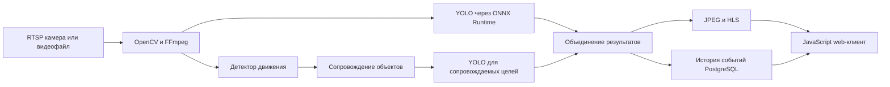
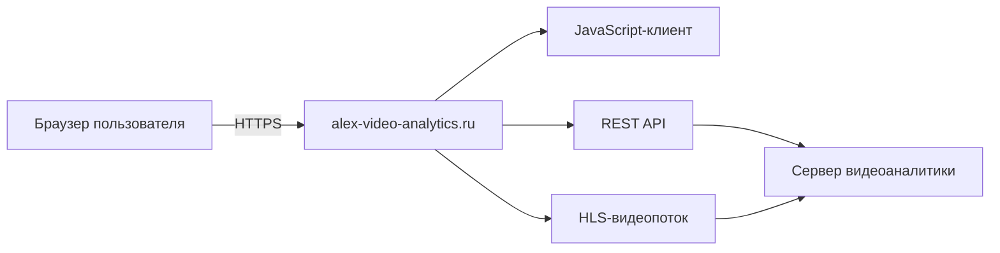

# Платформа видеоаналитики

Документационный репозиторий самостоятельного проекта Александра Кудряшова в области видеоаналитики и Computer Vision. Исходный код серверов и клиентских приложений не публикуется.

Проект демонстрирует проектирование полного конвейера обработки видео в реальном времени: от подключения RTSP-камеры до детекции объектов, сопровождения целей, хранения событий и просмотра результата через клиентское приложение.

## Архитектура решения

Система включает несколько совместимых компонентов:

- самостоятельный сервер C++20;
- сервер Python с тем же REST-контрактом;
- сервер Rust с тем же REST-контрактом и строгой моделью владения;
- браузерный клиент, разработанный на JavaScript.

Общий API и формат конфигурации позволяют использовать клиент с разными серверными реализациями.

## Публичный стенд

Все компоненты демонстрационного решения работают через публичный VPS [alex-video-analytics.ru](https://alex-video-analytics.ru/). Пользователь открывает JavaScript-клиент по HTTPS; тот же VPS предоставляет доступ к REST API и HLS-потоку и связывает клиентскую часть с сервером видеоаналитики.

Доступ к защищённым функциям предоставляется администратором. Тестовые логины и пароли в публичной документации не публикуются.

## Клиентская часть

Клиентская часть полностью разработана на JavaScript и запускается в современном браузере. Она использует ES Modules, Fetch API и `async/await` для REST-запросов, HTML5 Canvas для отображения аналитической разметки и hls.js с Media Source Extensions для воспроизведения HLS. Pointer Events обеспечивают работу с областями анализа и PTZ-управлением, а ResizeObserver поддерживает корректное масштабирование интерфейса.

Node.js 18 раздаёт статические файлы и выполняет роль ограниченного reverse proxy для REST API и HLS. Исходный код не публикуется; репозиторий содержит архитектурное описание, руководство и снимки работающего интерфейса.

## Реализованные возможности

- подключение к RTSP-камерам и обработка видеофайлов;
- автоматическое восстановление видеопотока после разрыва;
- детекция движения и сопровождение целей с постоянными идентификаторами;
- YOLO inference через ONNX Runtime;
- отдельный анализ полного кадра и сопровождаемых объектов;
- прямоугольные области YOLO и многоугольные области Tracking;
- индивидуальное разрешение анализа для каждой области;
- история обнаружений с временем, классом, confidence и снимком объекта;
- JPEG preview и HLS-поток для клиентских приложений;
- запись исходного видеопотока в H.264 и MP4;
- ONVIF PTZ для управления камерой;
- REST API, PostgreSQL и ролевая Bearer-аутентификация;
- сборка под Windows и развёртывание в Docker на Ubuntu.

## Технологии

| Направление | Технологии |
|---|---|
| Сервер C++ | C++20, Clang, Drogon, CMake, vcpkg |
| Сервер Python | Python, FastAPI, Uvicorn |
| Сервер Rust | Rust, Axum, Tokio, sqlx, Serde, Cargo |
| Computer Vision | OpenCV 5, YOLO, ONNX Runtime |
| Видео | RTSP, RTP, HLS, FFmpeg, H.264 |
| Данные и API | PostgreSQL, REST, OpenAPI, JSON, YAML |
| Клиентское приложение | JavaScript ES Modules, HTML5 Canvas, Fetch API, hls.js, Node.js 18 |
| Развёртывание | Windows, Ubuntu 24.04, Docker, Docker Compose |
| Проверка | контрактные тесты, pytest, k6, профилирование FPS и latency |

## Документация

- [Архитектура и потоки данных](docs/architecture.md)
- [Функциональные возможности](docs/capabilities.md)
- [Сервер видеоаналитики на Rust](docs/rust-server.md)
- [JavaScript-клиент](docs/web-client.md)
- [Руководство пользователя](docs/user-guide.md)
- [Тестирование и развёртывание](docs/testing-and-deployment.md)
- [Безопасность и границы публикации](docs/security.md)

## Статус

Проект развивается с июля 2026 года как самостоятельная практическая работа и портфолио для позиций Senior C++ Engineer, Software Architect и Video Analytics Engineer.

## Контакты

- GitHub: [alex-kudriashov](https://github.com/alex-kudriashov)
- Email: 79166829923@ya.ru
