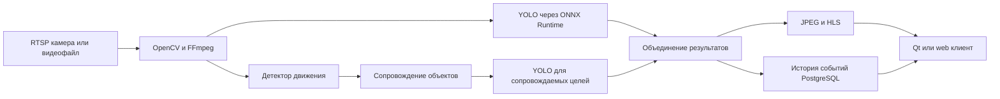

# Платформа видеоаналитики

Документационный репозиторий самостоятельного проекта Александра Кудряшова в области видеоаналитики и Computer Vision. Исходный код серверов и клиентских приложений не публикуется.

Проект демонстрирует проектирование полного конвейера обработки видео в реальном времени: от подключения RTSP-камеры до детекции объектов, сопровождения целей, хранения событий и просмотра результата через клиентское приложение.

## Архитектура решения

Система реализована в нескольких совместимых вариантах:

- сервер C++20 без Qt;
- сервер Python с тем же REST-контрактом;
- серверная версия на Qt;
- настольный Qt-клиент и web-клиент.

Общий API и формат конфигурации позволяют использовать клиент с разными серверными реализациями.

## Реализованные возможности

- подключение к RTSP-камерам и обработка видеофайлов;
- автоматическое восстановление видеопотока после разрыва;
- детекция движения и сопровождение целей с постоянными идентификаторами;
- YOLO inference через ONNX Runtime;
- отдельный анализ полного кадра и сопровождаемых объектов;
- прямоугольные области YOLO и многоугольные области Tracking;
- индивидуальное разрешение анализа для каждой области;
- история обнаружений с временем, классом, confidence и снимком объекта;
- JPEG preview и HLS-поток для клиентских приложений;
- запись исходного видеопотока в H.264 и MP4;
- ONVIF PTZ для управления камерой;
- REST API, PostgreSQL и ролевая Bearer-аутентификация;
- сборка под Windows и развёртывание в Docker на Ubuntu.

## Технологии

| Направление | Технологии |
|---|---|
| Сервер C++ | C++20, Clang, Drogon, CMake, vcpkg |
| Сервер Python | Python, FastAPI, Uvicorn |
| Computer Vision | OpenCV 5, YOLO, ONNX Runtime |
| Видео | RTSP, RTP, HLS, FFmpeg, H.264 |
| Данные и API | PostgreSQL, REST, OpenAPI, JSON, YAML |
| Клиентские приложения | Qt 6, JavaScript |
| Развёртывание | Windows, Ubuntu 24.04, Docker, Docker Compose |
| Проверка | контрактные тесты, pytest, k6, профилирование FPS и latency |

## Документация

- [Архитектура и потоки данных](docs/architecture.md)
- [Функциональные возможности](docs/capabilities.md)
- [Тестирование и развёртывание](docs/testing-and-deployment.md)
- [Безопасность и границы публикации](docs/security.md)

## Статус

Проект развивается с июля 2026 года как самостоятельная практическая работа и портфолио для позиций Senior C++ Engineer, Software Architect и Video Analytics Engineer.

## Контакты

- GitHub: [alex-kudriashov](https://github.com/alex-kudriashov)
- Email: 79166829923@ya.ru

