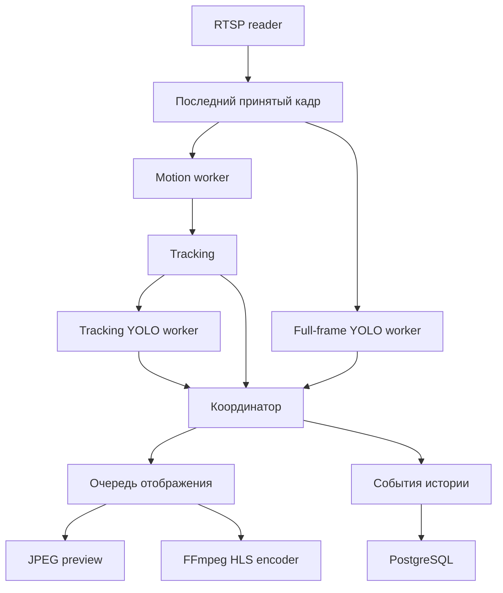

# Архитектура и потоки данных

## Цели архитектуры

Система должна обрабатывать живой видеопоток без неограниченного накопления задержки, сохранять управляемость при высокой нагрузке и продолжать обслуживать REST API при временной недоступности камеры или базы данных.

## Основной видеоконвейер

Захват кадров, детекция движения, сопровождение, нейросетевой inference и кодирование HLS выполняются независимо. Медленный этап не блокирует всю систему.

## Управление задержкой

Для большинства границ используется стратегия последнего актуального значения. Очереди имеют ограниченную глубину, поэтому при перегрузке устаревшие кадры отбрасываются. Это снижает аналитический FPS, но не позволяет задержке расти со временем.

Клиентский видеопоток формируется отдельно от аналитики. Буфер отображения сглаживает сетевой джиттер, а HLS-кодировщик получает только последний подготовленный кадр.

## Две серверные реализации

C++20 и Python серверы поддерживают одинаковый REST-контракт и структуру конфигурации. Это позволяет:

- сравнивать производительность реализаций на одном сценарии;
- проверять совместимость через общий набор контрактных запросов;
- использовать один web-клиент для обоих серверов;
- переносить архитектурные решения между языками без изменения внешнего API.

## Состояние и конфигурация

REST-обработчики не управляют объектом захвата напрямую. Они изменяют защищённое состояние и публикуют запрос на применение новой конфигурации. Видеопоток принимает изменения в своей точке синхронизации.

Настройки камер, областей анализа и параметров детекторов хранятся отдельно от временных runtime-файлов. Пароли камер не возвращаются клиенту через REST API.

## История событий

Tracking History хранит жизненный цикл сопровождаемого объекта: появление, уточнение класса, объединение дубликатов и потерю цели. YOLO History ведёт отдельную историю полнокадровых детекций.

События записываются в PostgreSQL параметризованными запросами. Если база данных временно недоступна, обработка видео продолжается, а клиент получает диагностический статус.

