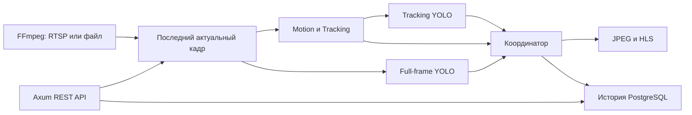

# Сервер видеоаналитики на Rust

## Назначение

RustVideoAnalyticsServer реализует тот же REST-контракт `/api/v1/*`, что серверы на C++20 и Python. Поэтому JavaScript Viewer и общий набор контрактных тестов работают без изменения пользовательского сценария.

## Технологический стек

- Rust и Cargo;
- Axum и Tokio для REST API и асинхронной оркестрации;
- Serde для конфигурации и JSON-контракта;
- sqlx для PostgreSQL;
- FFmpeg для RTSP, HLS и записи MP4;
- ONNX Runtime для двух независимых контуров YOLO.

## Владение и многопоточность

Кадр передаётся между этапами как общий неизменяемый объект. Ownership, `Arc`, `Send` и `Sync` делают границы владения и межпоточной передачи явными. Tokio обслуживает REST и асинхронные операции, а вычислительные этапы видеоконвейера выполняются в отдельных потоках ОС.

Однослотовая передача последних значений ограничивает backpressure: медленный inference не создаёт растущую очередь устаревших кадров. Приоритет захвата, координатора и вывода отделён от ресурсоёмких потоков YOLO.

## Реализованные возможности

- захват RTSP и видеофайлов с автоматическим восстановлением;
- Motion и Tracking, реализованные на Rust без зависимости от OpenCV;
- полнокадровый YOLO и отдельный YOLO для сопровождаемых объектов;
- JPEG preview, HLS и запись H.264/MP4;
- история событий в PostgreSQL;
- Bearer-аутентификация, роли, управление камерами и ONVIF PTZ;
- совместимость с общей конфигурацией, JavaScript Viewer и контрактными тестами.

Сервер проверен на реальной RTSP-камере 2304×1296 с моделью YOLO в формате ONNX. Исходный код остаётся закрытым; здесь опубликованы архитектура, стек и инженерные решения.
