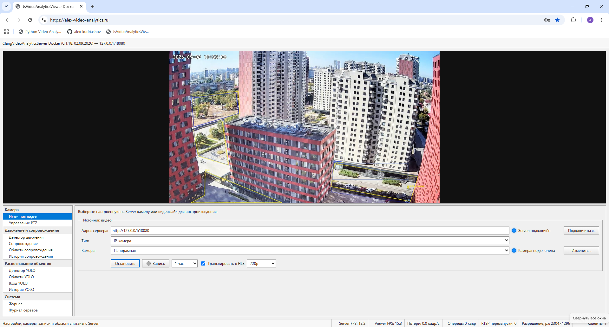
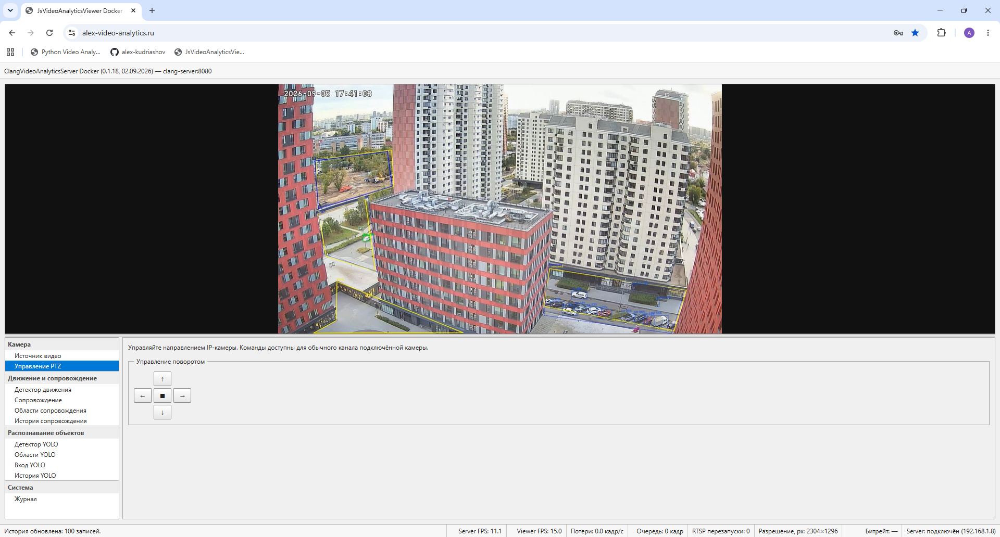
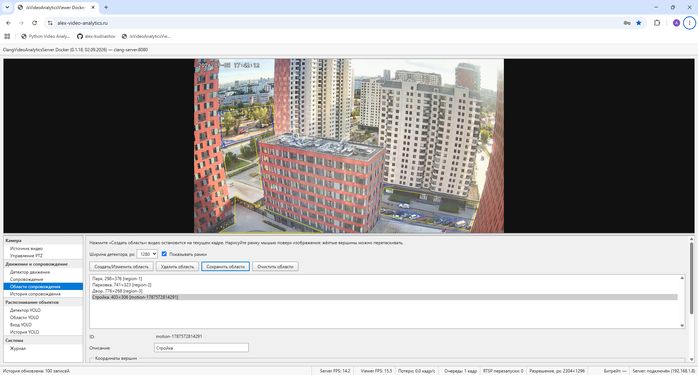
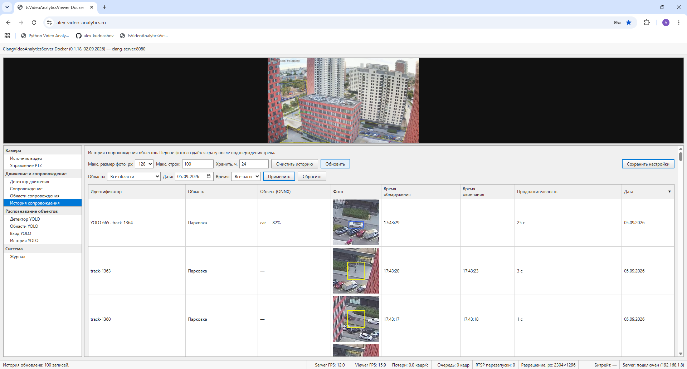
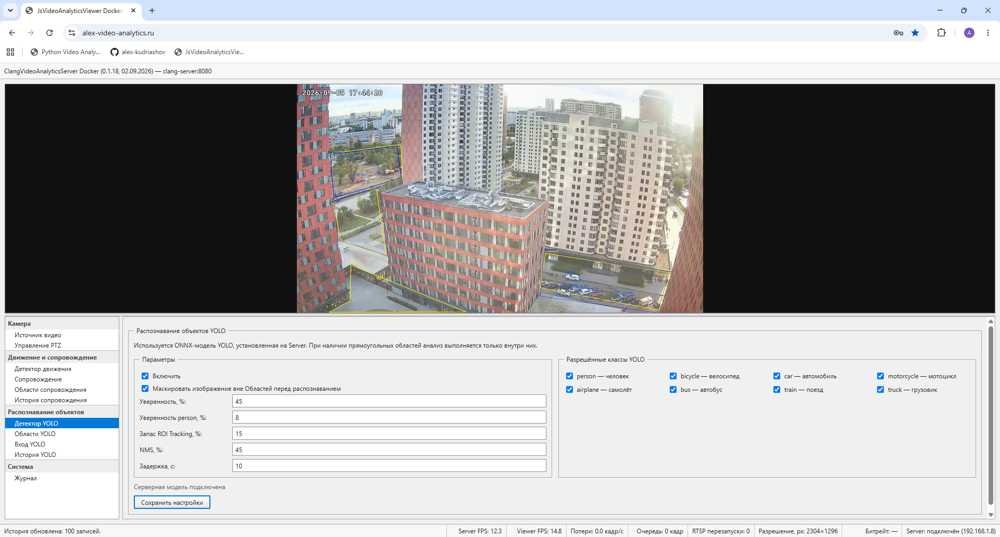
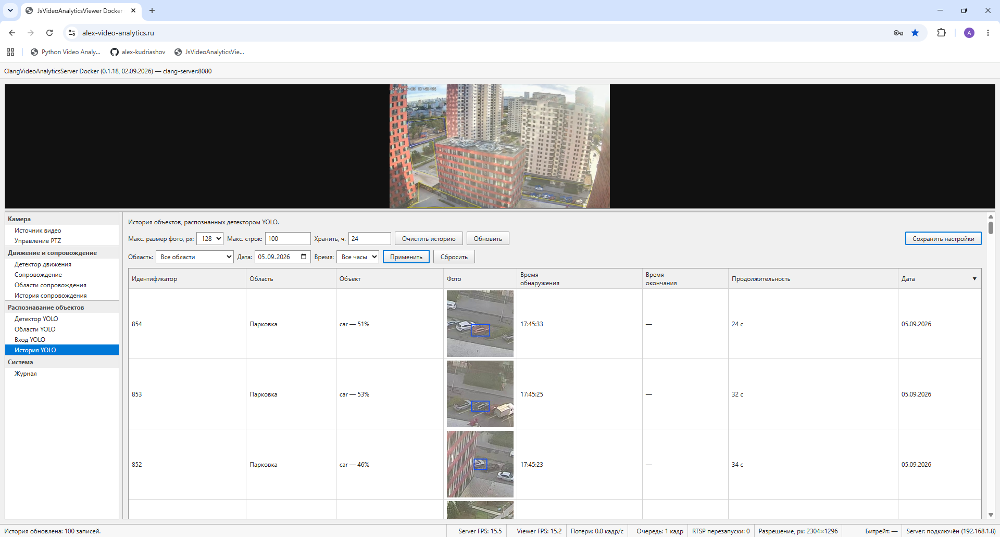

# Руководство пользователя

## Подключение

1. Откройте [alex-video-analytics.ru](https://alex-video-analytics.ru/) в современном браузере.
2. Для защищённых функций используйте учётные данные, полученные у администратора.
3. После входа выберите нужный раздел в навигации клиента.

Публичная документация намеренно не содержит тестовых логинов и паролей.

## Источник видео

На экране источника задаются адрес RTSP-камеры или видеофайла и параметры переподключения. Состояние подключения и характеристики потока отображаются рядом с формой.

## Управление камерой

Раздел PTZ позволяет перемещать совместимую ONVIF-камеру и управлять масштабированием. Команды выполняются через сервер, поэтому браузеру не требуется прямое подключение к камере.

## Области Tracking

Многоугольные области определяют зоны, в которых выполняются детекция движения и сопровождение объектов. Точки области редактируются непосредственно поверх видеокадра.

## История Tracking

История содержит время события, идентификатор сопровождаемого объекта, уточнённый класс и сохранённый снимок. Фильтры помогают выбрать нужный период и тип событий.

## Настройка YOLO

В разделе YOLO выбираются модель, пороги confidence и NMS, анализ полного кадра или отдельных прямоугольных областей. Для каждой области можно назначить собственное разрешение inference.

## История YOLO

История полнокадровых обнаружений хранится отдельно от Tracking History. Пользователь может просматривать время, класс, confidence и снимок обнаруженного объекта.

## Просмотр видео

Клиент получает JPEG preview для оперативной настройки и HLS для непрерывного воспроизведения. JavaScript синхронизирует видео, рамки объектов, траектории и выбранные области анализа.

## Безопасность

Не публикуйте адреса камер, токены или пароли. Доступ к защищённым операциям выполняется через HTTPS и Bearer-аутентификацию, а учётные данные предоставляет администратор.
