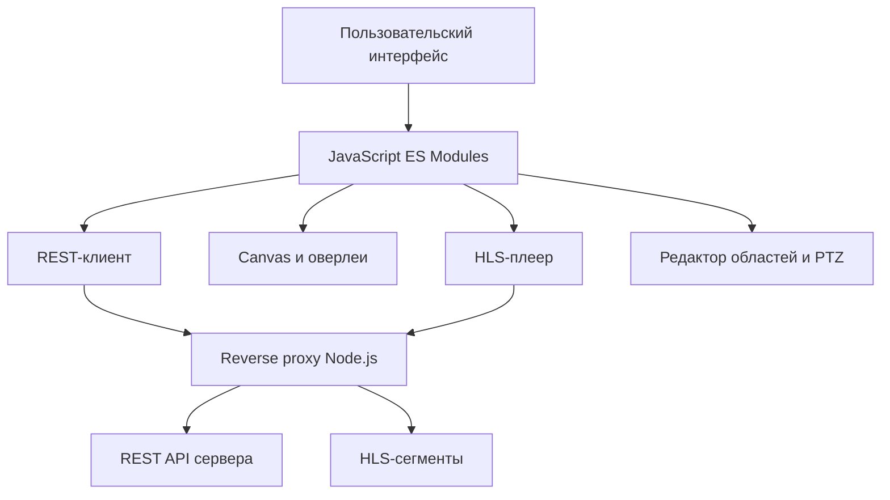

# Клиентская часть на JavaScript

## Назначение

Браузерный клиент предоставляет единый интерфейс для настройки источника видео, просмотра потока, управления аналитикой и работы с историей обнаружений. Он совместим с C++20- и Python-реализациями сервера благодаря общему REST-контракту.

## Технологический стек

- JavaScript с нативными ES Modules, без обязательного frontend-фреймворка;
- Fetch API, async/await и AbortController для REST-запросов и их отмены;
- HTML5 Canvas и ImageBitmap для кадров и аналитической разметки;
- HTML5 Video, hls.js и Media Source Extensions для HLS;
- Pointer Events для мыши, пера и сенсорного управления;
- ResizeObserver для адаптации рабочей области;
- sessionStorage для данных текущего сеанса;
- Node.js 18 для раздачи статических файлов и ограниченного reverse proxy.

## Устройство клиента

Интерфейс работает асинхронно в событийном цикле браузера. Сетевые запросы, воспроизведение видео и отрисовка областей не блокируют друг друга. При переключении экранов устаревшие запросы отменяются, а графические слои масштабируются вместе с видео.

## Работа через публичный VPS

Публичная точка входа проекта — [alex-video-analytics.ru](https://alex-video-analytics.ru/). VPS принимает HTTPS-запросы браузера, отдаёт файлы JavaScript-клиента и маршрутизирует разрешённые запросы к REST API и HLS. Благодаря единой точке входа браузеру не требуется прямой доступ к внутреннему адресу сервера или камеры.

Защищённые операции требуют Bearer-аутентификации. Учётные данные выдаются администратором и не включены в публичный репозиторий.
